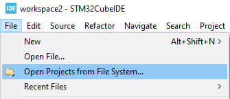
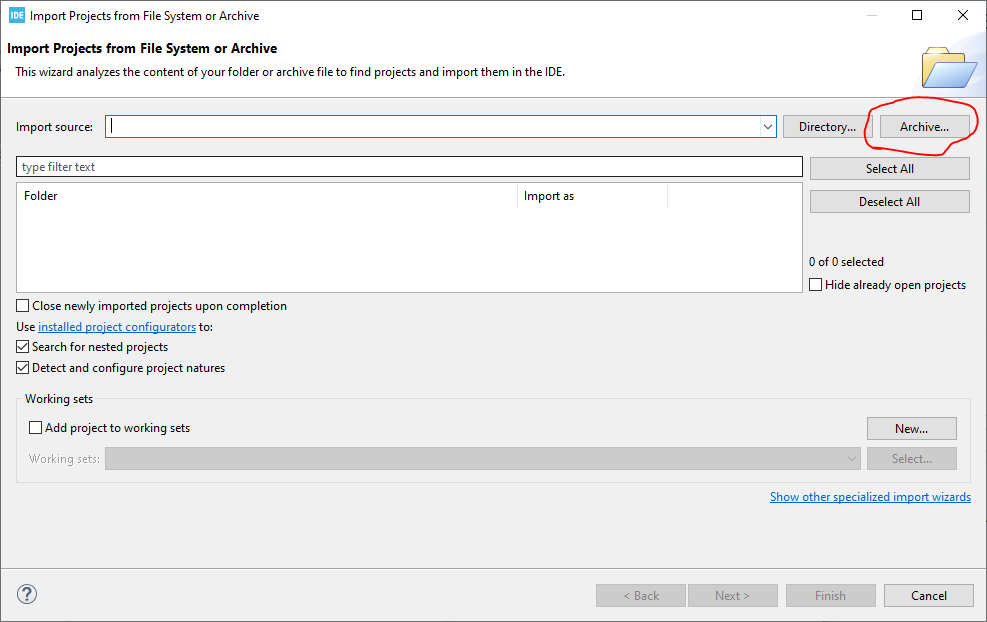
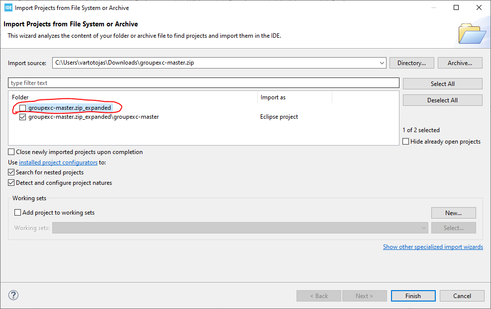
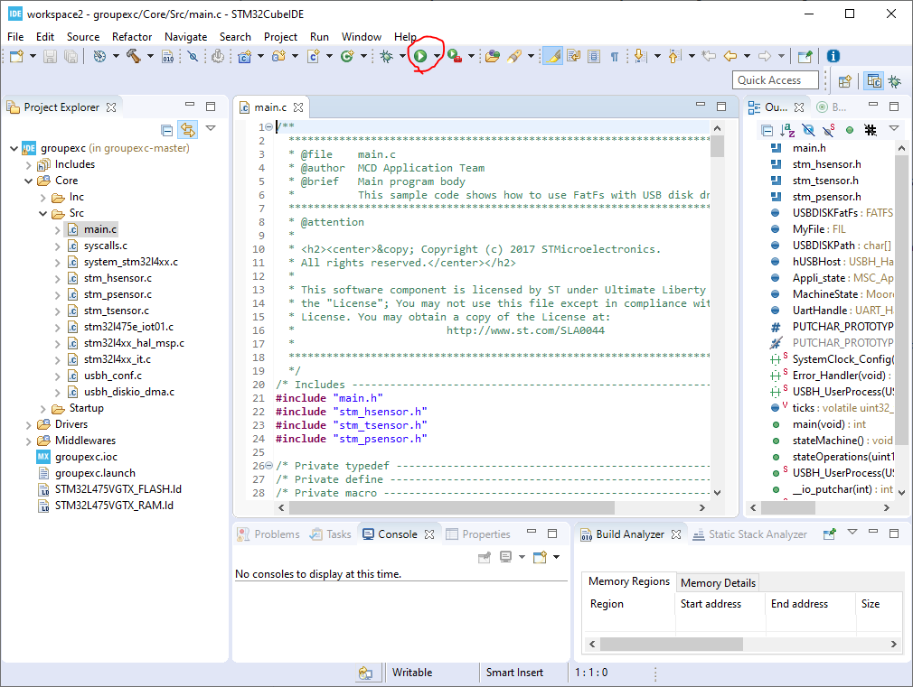

# University of Hull Third Year Electrical and Electronic Engineering Group I Exercise

Here is the code for the company exercise for Embedded Systems module. This was coded using STM32CubeIDE for the B-L475E-IOT01A board.

## How to set up

1. Download the code in a zip file by pressing the Code download button and selecting to download as zip file.

2. Open STM32CubeIDE and select Open Project from File System:

3. In the import wizard, press Archive and navigate to where the downloaded zip file of the code is:

4. Once the archive is selected, uncheck the first directory:

5. Press finish and you should see the project imported to your workspace. There, expand the project, navigate to Core, then Src and open main.c. Once opened, simply run the program.

### Using the program

To use it, you need a cable for the USB OTG input on the board. It is a micro AB connection, so it can take both micro A and B connections.

Once uploaded, insert your flash drive and you will see the data that is being written in the console. Once you want to take out the flash USB, press the user button to stop writing and you will find DATALOG.TXT file withing your USB drive.
